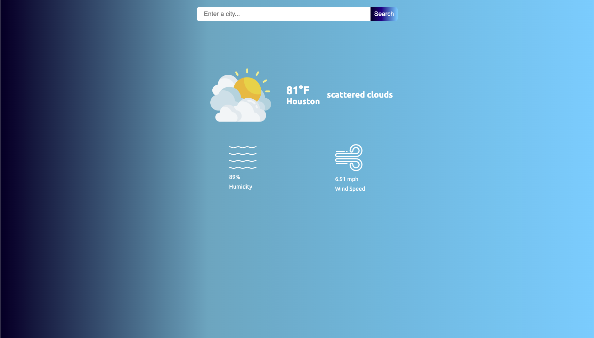

# React + Vite

This template provides a minimal setup to get React working in Vite with HMR and some ESLint rules.

Currently, two official plugins are available:

- [@vitejs/plugin-react](https://github.com/vitejs/vite-plugin-react/blob/main/packages/plugin-react) uses [Babel](https://babeljs.io/) for Fast Refresh
- [@vitejs/plugin-react-swc](https://github.com/vitejs/vite-plugin-react/blob/main/packages/plugin-react-swc) uses [SWC](https://swc.rs/) for Fast Refresh

## Expanding the ESLint configuration

If you are developing a production application, we recommend using TypeScript with type-aware lint rules enabled. Check out the [TS template](https://github.com/vitejs/vite/tree/main/packages/create-vite/template-react-ts) for information on how to integrate TypeScript and [`typescript-eslint`](https://typescript-eslint.io) in your project.

Screenshot

  

Weather App
A responsive weather application built with React and Vite, fetching live weather data from the OpenWeatherMap API. Users can search for any city to view real-time weather conditions including temperature, humidity, and wind speed.

Features
Live Weather Data: Fetches real-time weather from OpenWeatherMap API

City Search: Search for any city worldwide

Dynamic Weather Icons: Changes based on weather condition (e.g., rain, snow, clear)

Responsive Design: Works across mobile, tablet, and desktop

Deployed on GitHub Pages: Easily accessible online

Tech Stack
React (with Vite)

HTML5 / CSS3

JavaScript (ES6+)

OpenWeatherMap API

Installation
Clone the repository:

bash
Copy
Edit
git clone https://github.com/hieunguyen601/Weather-App-React-Project.git
Navigate to the project folder:

bash
Copy
Edit
cd Weather-App-React-Project
Install dependencies:

bash
Copy
Edit
npm install
Run development server:

bash
Copy
Edit
npm run dev
Deployment
This project is deployed using GitHub Pages.
Live Demo: https://hieunguyen601.github.io/Weather-App-React-Project/

